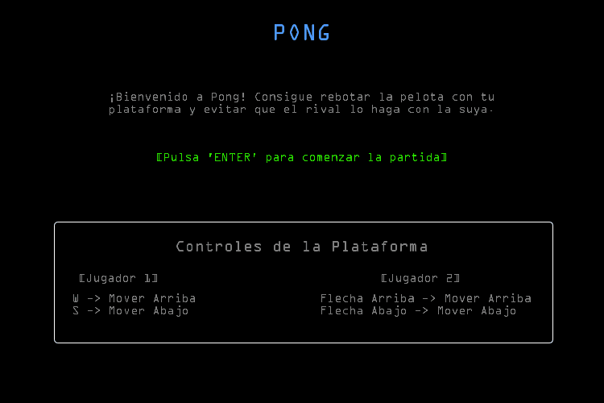
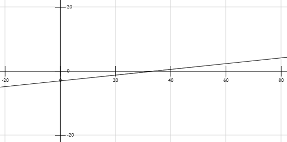
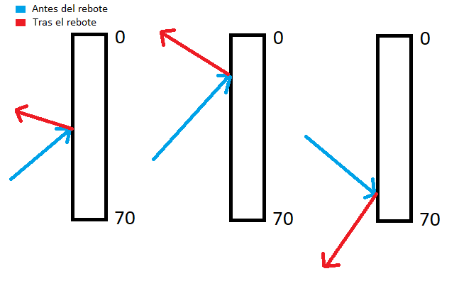
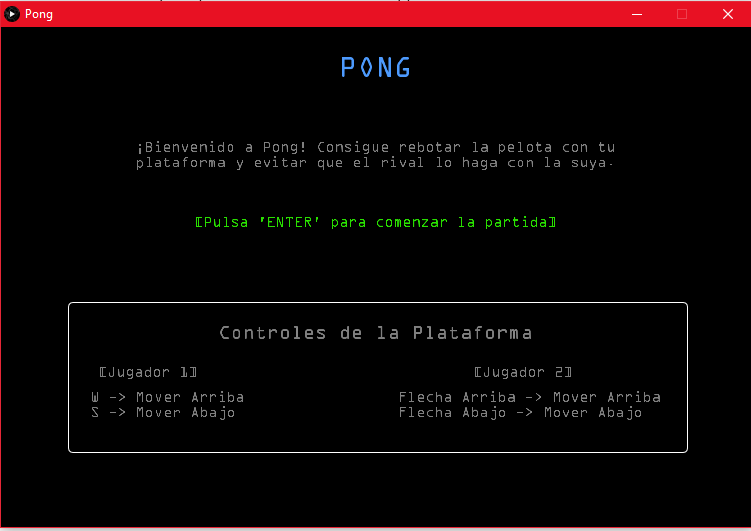

# Práctica 1 - Pong

## Memoria

### Autor

Kevin David Rosales Santana - <kevin.rosales101@alu.ulpgc.es>

### Índice

1. [Introducción](#1-introducción)
2. [Muestra del resultado](#2-muestra-del-resultado)
3. [Descripción del trabajo realizado](#3-descripción-del-trabajo-realizado)

   3.1 [Estructura de ficheros](#31-estructura-de-ficheros)
   
   3.2 [Decisiones en el desarrollo](#32-decisiones-en-el-desarrollo)
   
      - 3.2.1 [Física de la pelota](#321-física-de-la-pelota)
      
      - 3.2.2 [Sonido](#322-sonido)
      
      - 3.2.3 [Gestión de eventos del teclado](#323-gestión-de-eventos-del-teclado)
      
      - 3.2.4 [Aleatoriedad](#324-aleatoriedad)
      
      - 3.2.5 [Velocidad](#325-velocidad) 
      
      - 3.2.6 [Menú](#326-menú)
      
4. [Conclusión](#4-conclusión)
5. [Ejecución del Proyecto](#5-ejecución-del-proyecto)
6. [Referencias y herramientas utilizadas](#6-referencias-y-herramientas-utilizadas)

### 1. Introducción

En la presente práctica se pedía implementar el **Pong** para dos jugadores, sirviendo para el aprendizaje de *Processing*, el cual tiene como objetivo facilitar los desarrollos con fines creativos en entornos digitales. 

El **Pong** es un videojuego que está basado en el deporte de *ping-pong*, donde mediante dos plataformas (una por jugador) se debe hacer rebotar una pelota tratando que el adversario no pueda realizar esta acción al acercarse la pelota a su plataforma. 

Por tanto, en este repositorio se tiene una implementación de este videojuego que incluye:

- Rebote de la pelota en las plataformas y en las paredes horizontales (borde superior e inferior).
- Marcador de puntos.
- Sonido cuando se producen los rebotes y cuando se consigue un punto.
- Movimiento inicial aleatorio.
- Menú previo al inicio del juego (aportación propia del estudiante).

### 2. Muestra del resultado

Figura 1: Muestra del resultado

### 3. Descripción del trabajo realizado

#### 3.1 Estructura de ficheros

Para realizar este trabajo, se han creado estos cuatro ficheros (presentes en la carpeta [Practica1](./Practica1)):

| Fichero          | Descripción                                                  |
| :--------------- | :----------------------------------------------------------- |
| *Practica1.pde*  | Fichero encargado de la **interfaz gráfica** del juego. Además, al ser el fichero principal, gestiona el `setup()` y el `draw()` del proyecto haciendo uso del resto de ficheros del este. Por último, incluye el gestor de eventos del teclado. |
| *Controller.pde* | Clase **controlador** del juego. Se encarga de gestionar el movimiento de las plataformas y de la pelota. Además, gestiona el marcador y la reproducción de efectos de sonido. |
| *Platform.pde*   | Clase **modelo** que representa a un objeto *plataforma*.    |
| *Ball.pde*       | Clase **modelo** que representa a un objeto *pelota*.        |

Tabla 1: Estructura de ficheros

#### 3.2 Decisiones en el desarrollo

A la hora de realizar el **Pong** se ha tenido que tomar una serie de decisiones respecto al desarrollo del proyecto. A continuación, se listarán dichas decisiones:

##### 3.2.1 Física de la pelota

A la hora de gestionar el movimiento de la pelota y el efecto de los rebotes (tanto de las paredes horizontales de los bordes superior e inferior como de las plataformas), se ha tenido que reflexionar sobre la mejor forma de hacer que dicho movimiento sea lo más realista posible.

Para lograr este efecto, se ha programado el movimiento para que:

- En primer lugar, **el movimiento inicial al crear la pelota sea aleatorio.**

- Al chocar con una pared horizontal, su rebote tenga las mismas características pero **en sentido contrario en el eje Y** (de esta manera la pelota no sale del escenario).

- **Al chocar con una plataforma, se produce la siguiente fórmula** para calcular la nueva trayectoria:

`ball.vy = 0.09*(ball.py-p.jy)-3`

Fórmula 1: Cálculo de nueva trayectoria

Teniendo en cuenta que `(ball.py-p.jy)` es la distancia de la pelota hasta el borde superior de la plataforma y por tanto su valor se encuentra en [0,70] (dado a que 70 es la altura de la plataforma), se trata de una función que representada resulta así:

Figura 2: Representación de la función

Con esto se consigue que la componente que define la desviación `vy` de la pelota, consiga un valor entre [0,3] tras su rebote **dependiendo de dónde haya chocado con la plataforma**. A continuación se muestran unos ejemplos:

Figura 3: Ejemplos de rebote

##### 3.2.2 Sonido

Se han implementado un total de **3 efectos de sonido** procedentes de [freesound (Referencia 1)](#6-referencias-y-herramientas-utilizadas): 

- Tras el rebote con las paredes horizontales [(8-Bit Bounce)](https://freesound.org/people/SomeGuy22/sounds/361230/#).
- Tras el rebote con la plataforma [(PongBlipF4.wav)](https://freesound.org/people/NoiseCollector/sounds/4359/#).
- Tras obtener un punto ([8-bit Uh-Oh Sound](https://freesound.org/people/JapanYoshiTheGamer/sounds/361255/#)).

Siguiendo las [indicaciones de la práctica (Referencia 4)](#6-referencias-y-herramientas-utilizadas), para evitar efectos extraños al reproducir sonido dependiendo de su duración, **se han lanzado hilos reproducen dichos efectos.** Los hilos se lanzan desde la clase *Controller.pde* y están localizados en *Practica1.pde*.

##### 3.2.3 Gestión de eventos del teclado

Para la gestión de eventos del teclado, se ha utilizado la función `keyPressed()` y `keyReleased()`. Lo más importante de esta gestión es la capacidad de **poder leer más de una entrada al mismo tiempo del teclado** (ya que se trata de un juego para dos personas en este caso). Por ello, es necesario captar tanto cuando una tecla es pulsada como cuando una tecla deja de serlo.

Teniendo dentro del objeto de la propia plataforma el estado de sus respectivas teclas `isUpPressed` e `isDownPressed`, tan solo hay que mover la plataforma acorde con la que se encuentre pulsada (siempre y cuando la plataforma no se moviera fuera del escenario de juego).

##### 3.2.4 Aleatoriedad

Otra componente estudiada es la de la aleatoriedad. Cuando se genera la pelota, se decide aleatoriamente a qué lado (**sentido**) y con qué **velocidad** y **dirección** se moverá como primer movimiento. 

##### 3.2.5 Velocidad

Al igual que `vy` define en gran parte la dirección que toma la pelota, `vx` define su velocidad. Por ello, se ha construido un componente inicial `dx` en la pelota que define la rapidez con la que **la velocidad de la pelota evoluciona tras cada rebote en una plataforma.**

Sin embargo, se debe tener en cuenta que la velocidad debe tener un límite para que se capturen de forma correcta los rebotes. Además, al tratarse de un juego, este límite puede tratar de adaptarse al propio límite de la percepción humana al usar este producto. En este **Pong** cuando el componente `vx` de la pelota llega a ser mayor que 8, la pelota deja de aumentar la velocidad en cada rebote con las plataformas.

##### 3.2.6 Menú

Como aportación propia, se ha desarrollado un menú previo al juego que introduce a los usuarios al **Pong** y les informa sobre sus **controles**:

Figura 4: Menú inicial previo al juego

Para realizar este menú, se han seguido las indicaciones de la [referencia de Processing (Referencia 2)](#6-referencias-y-herramientas-utilizadas). Por ello, se realiza un `noLoop()` al ejecutar el `setup()`, evitando que se ejecute en bucle el `draw()`.  Además, se dibuja el menú que se puede observar en la *Figura 4*.

Al pulsar `ENTER`, se llama a `loop()` (reanudando el bucle del `draw()`) y se desactiva el "Modo menú" que no permitía acceder al contenido del `draw()`. 

**Nota importante**: Para pulsar `ENTER` y hacer que comience el videojuego, la ventana de este debe estar *focuseada*.

### 4. Conclusión

Esta práctica ha servido como una introducción a *Processing* y, además, se ha tratado de una práctica muy entretenida donde se ha tenido contacto con una herramienta que permite facilitar el tipo de desarrollos similares al visto en este proyecto.

Además, realizar este tipo de trabajos da una idea del esfuerzo que hay detrás por parte de los programadores de videojuegos para cuidar el resultado final de este.

Por último, se debe recalcar que gracias a esta primera práctica de *Creando Interfaces de Usuario*, ahora se tiene una herramienta que **simplifica bastante la construcción de este tipo de trabajos** respecto a las vistas hasta ahora en el Grado en Ingeniería Informática. 

### 5. Ejecución del proyecto

Para ejecutar este proyecto, es necesario:

- Tener instalado [Processing (Referencia 3)](#6-referencias-y-herramientas-utilizadas)
- Haber instalado la librería *Sound*, de *The Processing Foundation* [(ver página 39 de la Referencia 4)](#6-referencias-y-herramientas-utilizadas). 

Para ejecutar el proyecto, tan solo se debe abrir el fichero [Practica1.pde](./Practica1/Practica1.pde) y darle al botón de ejecutar.

### 6. Referencias y herramientas utilizadas

- [1] Universitat Pompeu Fabra. [Freesound.](https://freesound.org/)
- [2] Processing Foundation. [Processing Reference.](https://processing.org/reference/)
- [3] Processing Foundation. [Processing Download.](https://processing.org/download/)
- [4] Modesto Fernando Castrillón Santana, José Daniel Hernández Sosa. [Creando Interfaces de Usuario. Guion de Prácticas](https://cv-aep.ulpgc.es/cv/ulpgctp20/pluginfile.php/126724/mod_resource/content/22/CIU_Pr_cticas.pdf)
- [5] Extrapixel. [GifAnimation Processing Library.](https://github.com/extrapixel/gif-animation)

